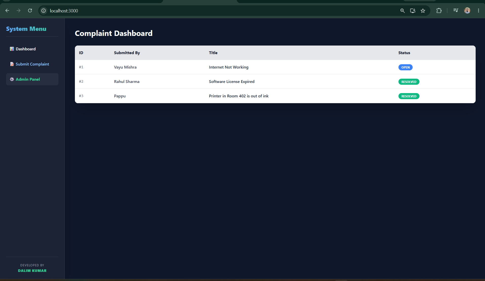
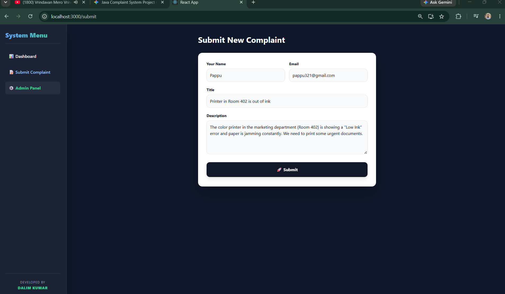
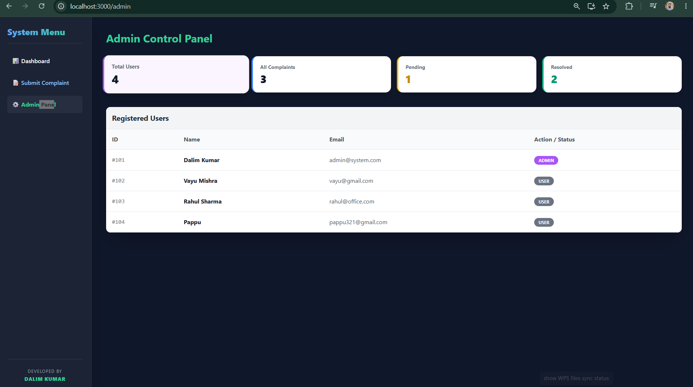

🚀 Online Complaint Management System


A modern, robust, and full-stack **Online Complaint Management System** designed to streamline issue reporting and resolution for organizations. Built with a robust Java/Spring Boot backend and a highly interactive React.js frontend.

## 📸 Application Preview

### 📊 Complaint Dashboard


### 📝 Submit Complaint Form


### ⚙️ Admin Control Panel


---

## ✨ Key Features

### 👤 User Module
* **Quick Complaint Submission:** Easy-to-use form to submit detailed complaints.
* **Auto-Registration:** Seamlessly creates a user profile on the first complaint submission.
* **Real-time Status Tracking:** View the current status of complaints (OPEN, IN PROGRESS, RESOLVED).
* **Audit Logs:** Complete history and timeline of every action taken on a complaint.

### 🛡️ Admin Module
* **Interactive Dashboard:** Dynamic statistics cards (Total Users, Total Complaints, Pending Actions, Resolved).
* **User Management:** View and manage all registered users and their roles (ADMIN/USER).
* **Action Center:** Quickly review and resolve pending complaints with a single click.
* **Advanced Filtering:** Filter complaints by their current status.

## 🛠️ Technology Stack

* **Frontend:** React.js, React Router DOM, Tailwind CSS (for modern UI/UX).
* **Backend:** Java 17, Spring Boot, RESTful APIs.
* **Database:** SQL Relational Database (via Spring Data JPA).
* **Architecture:** Layered Architecture (Controller, Service, Repository, Entity).

## 📂 Project Structure

```text
online-complaint-system/
├── complaint-frontend/       # React.js Frontend Application
├── output/                   # Application Screenshots
├── src/main/java/.../        # Spring Boot Backend Code
│   ├── config/               # Security & App Configurations
│   ├── controller/           # REST API Endpoints
│   ├── entity/               # Database Models
│   ├── exception/            # Custom Error Handling
│   ├── repository/           # Data Access Layer
│   └── service/              # Business Logic Layer
└── pom.xml                   # Maven Dependencies
⚙️ How to Run Locally
Prerequisites
Java Development Kit (JDK 17 or higher)

Node.js & npm

Maven

Step 1: Run Backend (Spring Boot)
Open the project in your favorite IDE (VS Code / IntelliJ).

Let Maven download all dependencies.

Run ComplaintApplication.java from src/main/java/...

Step 2: Run Frontend (React)
Open a new terminal.

Navigate to the frontend directory:

Bash
cd complaint-frontend
Install the required npm packages:

Bash
npm install
Start the React development server:

Bash
npm start
The application will be available at http://localhost:3000.

👨‍💻 Developed By
Dalim Kumar

